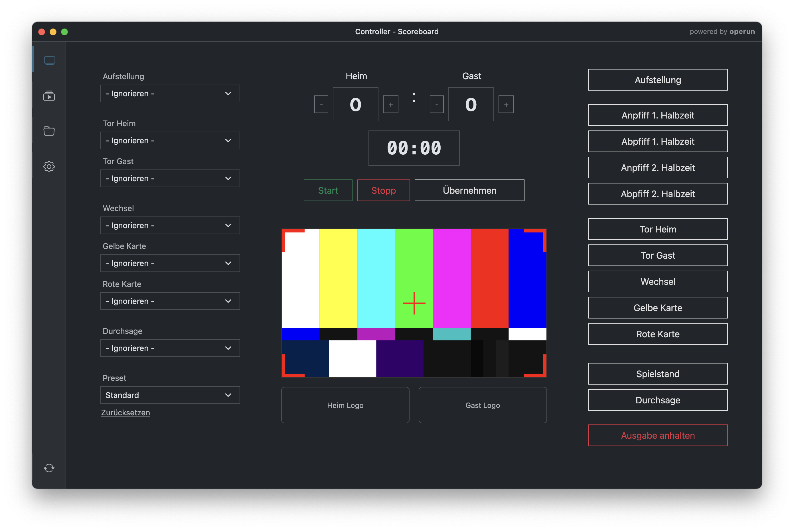
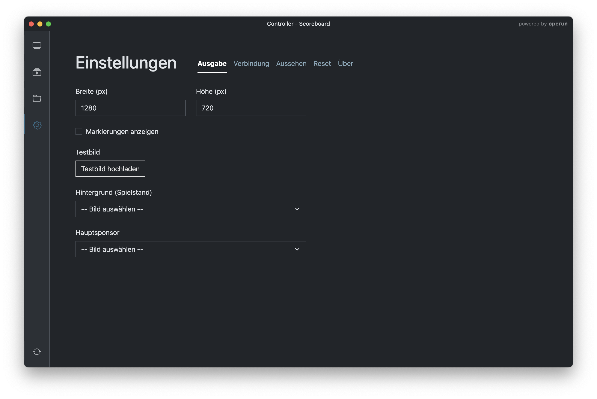

# Scoreboard

[](https://github.com/operun/scoreboard/actions/workflows/build-windows.yml)
[](CHANGELOG.md)
[](LICENSE.txt)

An Electron desktop app for live control of videowalls and scoreboards at sports events. Built for TSV 1880 Wasserburg.

The app runs two windows side by side: a **controller window** for the operator behind the scenes, and a **frameless output window** that is captured by the videowall hardware.

---

## Features

- **Media management** — Import images and videos, automatic thumbnail generation
- **Playlist editor** — Build sequences with configurable display durations, drag-and-drop reordering
- **Live controller** — Play playlists, trigger instant event overlays, switch scenes in real time
- **Scoreboard overlay** — Score, match timer, team logos, and sponsor display
- **Event overlays** — Substitution, yellow/red card, corner, announcement, overtime
- **SSH sync** — Push media and playlists to a remote installation over SSH
- **Settings** — Output resolution, dark/light mode, visibility toggles, test image upload

---

## Screenshots





---

## Requirements

- Windows 10/11 (x64) — primary target platform
- macOS — supported for development
- [Node.js](https://nodejs.org) 22 or later

---

## Getting Started

### Install

```bash
git clone https://github.com/operun/scoreboard.git
cd scoreboard
npm install
```

### Run in development

```bash
npm run start
```

This starts the Vite dev server and launches Electron. Hot reload is active for renderer changes.

### Build

Releases are built automatically via GitHub Actions when a version tag is pushed:

```bash
npm run release:patch   # 1.2.0 → 1.2.1
npm run release:minor   # 1.2.0 → 1.3.0
npm run release:major   # 1.2.0 → 2.0.0
```

The workflow builds a Windows NSIS installer and uploads it as a GitHub Release asset.

To build locally:
```bash
npm run build
```

Output: `dist-electron/Scoreboard Setup x.x.x.exe`

---

## Project Structure

```
main.js          Electron main process — IPC handlers, file I/O, SSH sync
preload.js       Context bridge — exposes safe IPC API to renderer
settingsStore.js Settings read/write (plain JSON)
afterPack.js     Post-build hook — replaces bundled ffmpeg with H.264/AAC variant
src/
  App.jsx              Router, layout, global state
  ControllerView.jsx   Live operator interface
  OutputView.jsx       Fullscreen output (videowall feed)
  MediaView.jsx        Media import and management
  PlaylistsView.jsx    Playlist overview
  EditPlaylistView.jsx Playlist editor
  SettingsView.jsx     App configuration
  components/          Shared UI components and output scenes
```

---

## How It Works

The controller and output windows communicate via Electron IPC. The main process handles all file system access, SSH connections, and event routing.

```
Controller Window ──IPC──► Main Process ──IPC──► Output Window
                                │
                           userData/
                           ├── settings.json
                           ├── media.json
                           ├── playlists.json
                           ├── presets.json
                           └── media/
```

All data is stored locally in the OS user data directory (`%APPDATA%\Scoreboard` on Windows, `~/Library/Application Support/Scoreboard` on macOS).

---

## SSH Sync

To synchronize media and playlists to a remote installation:

1. Open **Settings → Sync**
2. Configure the sync host and user
3. Generate an SSH key pair in the app
4. Send the public key to your server administrator (or use the in-app send button)
5. Once the key is authorized, use the **Sync** button in the controller

---

## Contributing

Pull requests are welcome. For significant changes, please open an issue first to discuss what you would like to change.

This project uses [Conventional Commits](https://www.conventionalcommits.org/) for commit messages.

---

## Changelog

See [CHANGELOG.md](docs/CHANGELOG.md).

---

## License

This project is licensed under the GNU General Public License v3.0 — see [LICENSE.txt](LICENSE.txt) for details.